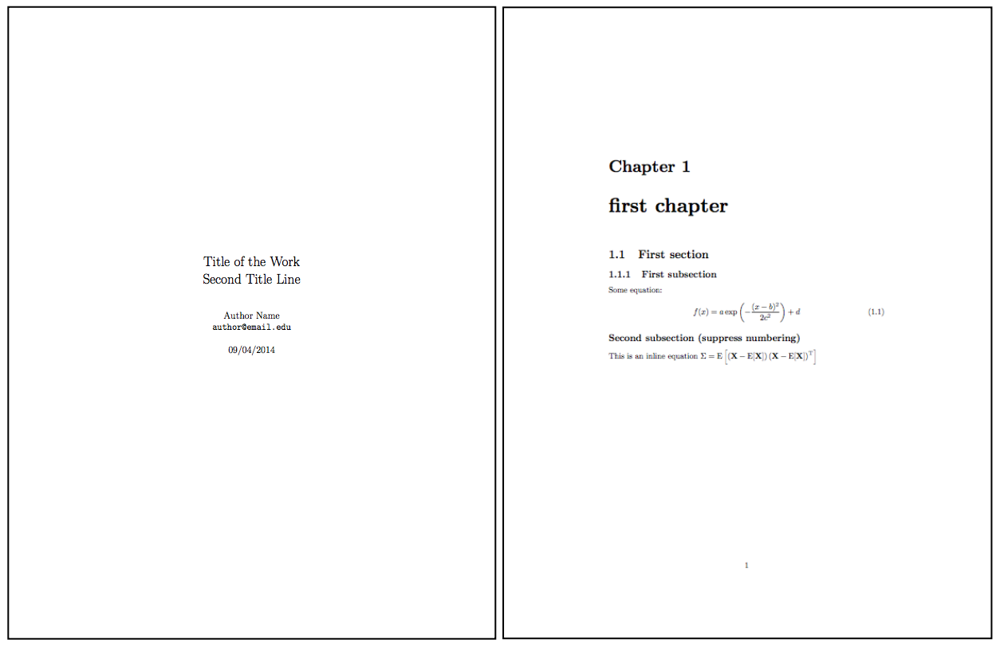
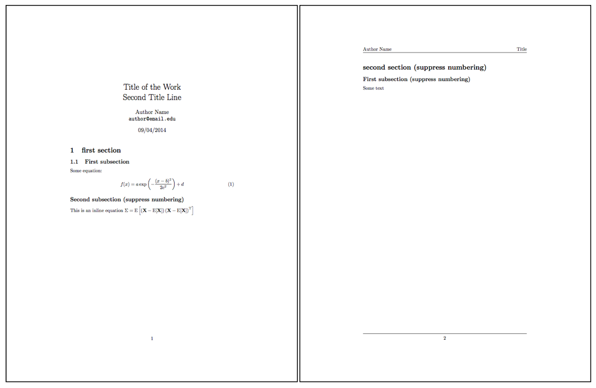
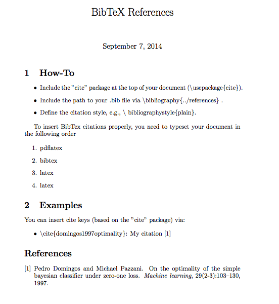
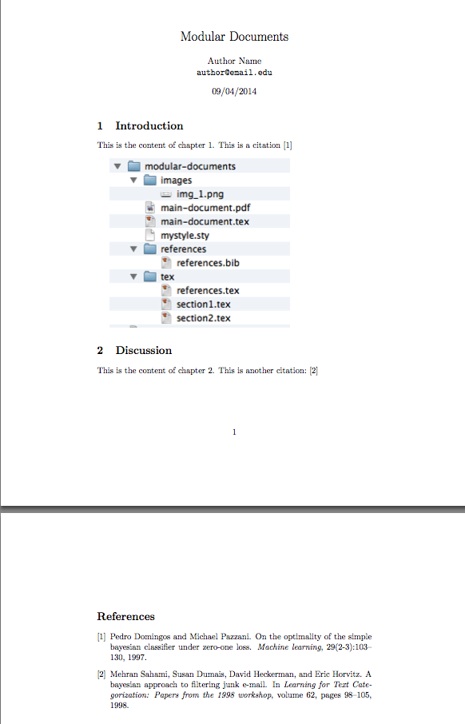

# latex-templates

LaTeX templates

 
 

#Sections
- [Basic Document Styles](#basic-document-styles)
- [Using BibTeX References](#using-bibtex-references)
- [Modular Documents](#modular-documents)
 
 

## Basic Document Styles
[[back to top](#sections)]
 
 

### Report style with headers and footers
[[back to top](#sections)]

[[Download .tex](https://raw.githubusercontent.com/rasbt/latex-templates/master/document-styles/tex/report_header_footer.tex)] [[Download PDF](https://github.com/rasbt/latex-templates/blob/master/document-styles/tex/report_header_footer.pdf?raw=true)]

 
 

### Article style with headers and footers
[[back to top](#sections)]

[[Download .tex](https://raw.githubusercontent.com/rasbt/latex-templates/master/tex/article_header_footer.tex)] [[Download PDF](https://github.com/rasbt/latex-templates/blob/master/document-styles/tex/article_header_footer.pdf?raw=true)]

 
 

### Using BibTeX References
[[back to top](#sections)]

[Go to](./references) example folder.  

For more details, see [LaTeX Bibliography Management](http://en.wikibooks.org/wiki/LaTeX/Bibliography_Management).

 
 

### Modular Documents
[[back to top](#sections)]

Modular documents are especially handy if you are writing longer texts, such as books or reports that consist of multiple chapters. Modular documents allow you organize your chapters in separate files and reunite them into one final document.

If you structure file like in the following example, all you need to do is to typeset the "main-document," which takes care of typesetting the individual sections, references, etc.

Download the modular-document template [[modular-template.zip](https://github.com/rasbt/latex-templates/raw/master/modular-documents/modular_template.zip)].

For more details, see [LaTeX Modular Documents](http://en.m.wikibooks.org/wiki/LaTeX/Modular_Documents).
